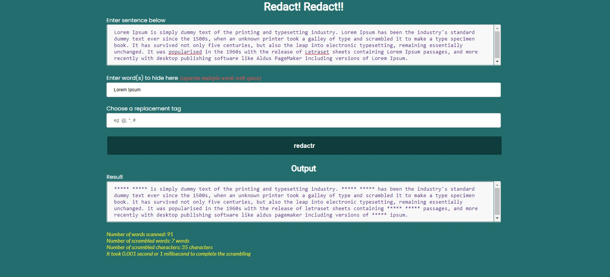

# TechHub Group Challenge

### What
Solidify what you’ve learnt by building cool simple things you can showcase

### Why
Practice makes perfect. We’re getting you ready for all the fun projects in the coming semester

### How
*   Build the below project as a group / team, using Repl.it 
*   Vanilla HTML/CSS and Javascript is sufficient to build these projects as fully functional apps, so don’t use any fancy libraries or frameworks. Doing so can cost you some points!
*   It’s a healthy competition amongst teams, so try your best to make your application functional, clean and presentable

## Table of contents

- [Overview](#overview)
  - [The challenge](#the-challenge)
  - [Scenario](#scenario)
  - [Outcome](#outcome)
  - [Advanced Features](#advanced-features)
  - [Screenshot](#screenshot)
  - [Links](#links)
  - [Built with](#built-with)
  - [What was learnt](#what-was-learnt)
  - [Continued development](#continued-development)
  - [Useful resources](#useful-resources)
- [Contributors](#contributors)
- [Acknowledgments](#acknowledgments)

## Overview

### The challenge : Redactr - Scramble some words from a body of text content

#### Scenario

Your app is to help people safely share content on social media by scrambling portions of the text they don’t want the world to read/see. A user will write/paste the some content into a form field and then specify the words they need to be scrambled (using another field). Note the user is allowed to specify more than one word (separated by space) to be scrambled.

#### Outcome
After clicking a “Redact Now” button, the app scans through the original text and replaces the specified words to be scrambled with asterisks (i.e ***)

#### Advanced features (OPTIONAL- build any, some or all of the following if you feel up to it) 

* Allow the user specify what to use in replacing the words, so that the app can do the scrambling with what the user provides, be it asterisks, questions marks, dashes, underscores, or even other words
* Display some stats like how many words were scanned, how many matched the words to be scrambled, how many characters were scrambled in total, how long it took (in seconds) to complete the scrambling task e.t.c. Feel free to be creative here

### Screenshot

### Links

- Solution URL: [Click here for solution URL](https://github.com/mchenryspagg/redact-project-grp6)
- Live Site URL: [Click here for live site URL](https://mchenryspagg.github.io/redact-project-grp6/)

### Built with

- HTML5 markup
- CSS
- Javascript

### What was learnt

The knowledge on how to collaborate in a team project is the first lesson learnt. Also, harnessing the strengths of every team members whilst overlooking the inherent weaknesses of others. Improvement in the knowledge and application of writing Javascript codes to solve programming problems.

### Continued development

More projects would be completed both as a team and as individuals. 

### Useful resources

- [The Complete Javascript course 2022 - From Zero to Hero](https://www.udemy.com/course/the-complete-javascript-course/) - This course is great to learn and master javascript with practical hands-on experience to test your learning as you go
- [Freecodecamp's Responsive Web Design](https://www.freecodecamp.org/learn/responsive-web-design/) - This is an amazing website and also a wonderful resource to learn web design. I learnt quite a lot from freecodecamp as a beginner. 

## Contributors

1. Henry Ugochukwu Okam - [Email](mailto:hnry_ugo@yahoo.com) | twitter - [@mchenryspagg](https://www.twitter.com/mchenryspagg)
2. Alofun Segun - [Email](mailto:segunalofun@protonmail.com) | linkedIn - [Segun Alofun] (https://www.linkedin.com/in/segunalf/)
3. Adedokun Olaitan - [Email](mailto:kenney9224@gmail.com)
4. Olabode Miracle Oluwabunmi - [Email](mailto:olabodemiracle.o@gmail.com)
5. Ejiroghene Laurel Dafe - [Email](mailto:dafelaurele@gmail.com)

## Acknowledgments
Special thanks to all the team members that contributed immeasurably to bring about the completion of this project. Special shoutout to AltschoolAfrica for the project brief, and also a special shoutout to the Tech Hub Slack community comprising of young passionate tech newbies and intermediate professionals striving to become worldclass software engineers through collaboration, knowledge sharing and motivating one another.

